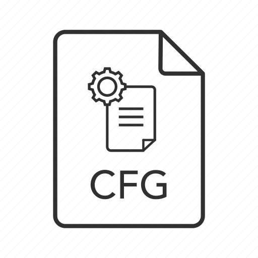

# Personal Configuration Files of Significance

## Motivation

Since my configuration files are always evolving, I wanted to record their evolution.
It's also a convenient way of ensuring the aliases I use daily are kept updated across
my several machines.

You can tell a lot about someone by content of their dotfiles. Heres mine.

